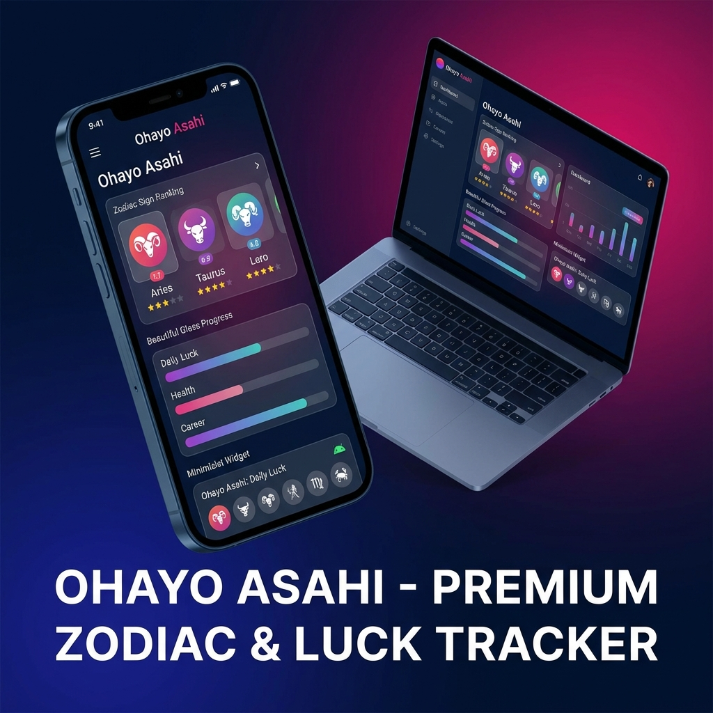

# 🌅 Ohayo Asahi — Premium Zodiac & Luck Tracker

[](https://flutter.dev)
[](#)
[](https://opensource.org/licenses/MIT)

**Ohayo Asahi** is a stunning, cross-platform Flutter application designed to bring the famous Japanese "Oha Asa" daily horoscopes to your fingertips. Built with a focus on visual excellence and seamless automation, it offers a premium experience for tracking your daily luck metrics.



---

## ✨ Key Features

### 🎨 Premium UI/UX
- **Glassmorphism Design**: Elegant translucent components with high-contrast typography.
- **Dynamic Gradients**: A curated color palette that transitions beautifully between deep indigo and vibrant magenta.
- **Micro-Animations**: Smooth entry transitions and interactive elements powered by `flutter_animate`.

### 📱 Native Android Widget (4x2 Premium)
- **4x2 Elegant Layout**: A sophisticated horizontal grid that showcases your rank, sign, and lucky items.
- **Background Sync**: Updates every 24 hours in the background, even if the app is closed.
- **Interactive**: Tap the widget to launch the app instantly.

### 🌐 Smart Data & Localization
- **Real-time Scraping**: Fetches data direct from the official TV Asahi source.
- **Automatic Translation**: Seamlessly translates Japanese horoscope data into English.
- **Birthday Solver**: Input your birthday once to automatically find and track your zodiac sign.
- **Sign Persistence**: Your preference is saved locally via `shared_preferences`.

### 🖥️ Desktop Ready
- **Native Windows Support**: High-performance C++ runner with a responsive, windowed layout.
- **Persistent Shell**: Built and optimized for a standalone executable experience.

---

## 🚀 Getting Started

### Prerequisites
- **Flutter SDK**: `^3.10.7`
- **Android**: Android Studio & SDK Platform 33+
- **Windows**: Visual Studio 2022 with "Desktop development with C++"

### Installation

1. **Clone the Repo**
   ```bash
   git clone https://github.com/kisalnelaka/oha-asa-app.git
   cd oha_asa_app
   ```

2. **Setup Dependencies**
   ```bash
   flutter pub get
   ```

3. **Run the Application**
   - **Android**: `flutter run -d android`
   - **Windows**: `flutter run -d windows`

---

## 🛠️ Tech Stack

| Category | Tools & Libraries |
| :--- | :--- |
| **Foundation** | Flutter, Dart |
| **Logic** | http, html (Scraping), translator |
| **Storage** | shared_preferences |
| **UI/UX** | flutter_animate, google_fonts, Glassmorphism |
| **Automation** | home_widget, workmanager (Android) |

---

## 📦 Distribution

To package the application for end-users:

**Android (APK)**
```bash
flutter build apk --release
```
*Output: `build/app/outputs/flutter-apk/app-release.apk`*

**Windows (EXE)**
```bash
flutter build windows --release
```
*Output: `build/windows/x64/runner/Release/` (Copy the entire folder)*

---

## 📝 License

Distributed under the MIT License. See `LICENSE` for more information.

---

<p align="center">
  Developed with ❤️ by <b>socialrabbit</b>
</p>
