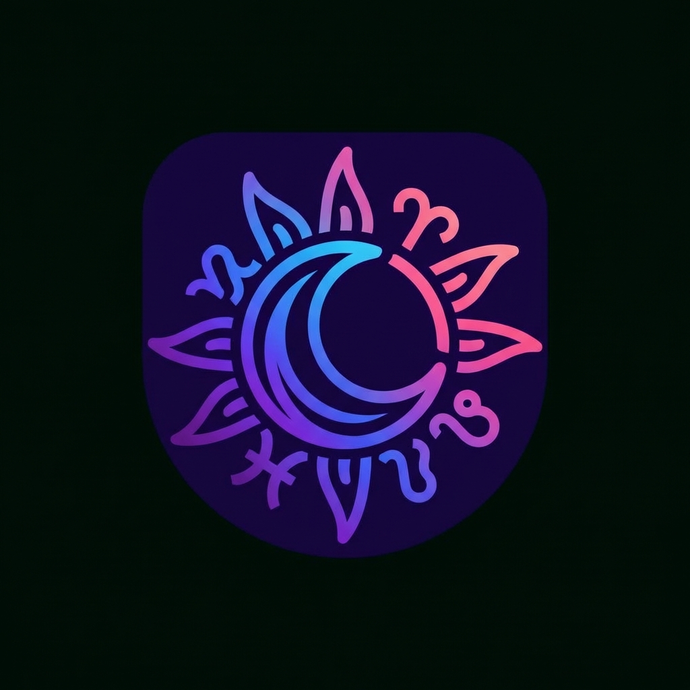

# Oha Asa Horoscope (Daily Zodiac)

A premium, modern Flutter application for the famous Japanese "Oha Asa" daily horoscope. Feature-rich, highly aesthetic, and built for both Windows and Android.



## ✨ Features

- **Premium UI/UX**: Deep dark-mode gradient theme with glassmorphism effects and smooth micro-animations.
- **Accurate Data**: Real-time scraping from the official TV Asahi Oha Asa horoscope source.
- **English Localization**: Automatic translation of Japanese horoscope descriptions, colors, and items.
- **Find Your Sign**: Built-in birthday-to-zodiac calculator.
- **Sign Persistence**: Your selected sign is saved locally and persists across app restarts.
- **Detailed Insights**: View comprehensive luck metrics for Money, Love, Work, and Health with beautiful progress bars.
- **Lucky Highlights**: Dynamic display of your daily lucky color and lucky item (key).

## 🚀 Getting Started

### Prerequisites
- [Flutter SDK](https://docs.flutter.dev/get-started/install) (v3.10.7 or higher)
- [Android Studio](https://developer.android.com/studio) (for Android builds)
- [Visual Studio](https://visualstudio.microsoft.com/) with Desktop development with C++ (for Windows builds)

### Installation
1. Clone the repository:
   ```bash
   git clone https://github.com/kisalnelaka/oha-asa-app.git
   ```
2. Navigate to the project directory:
   ```bash
   cd oha_asa_app
   ```
3. Install dependencies:
   ```bash
   flutter pub get
   ```

### Running the App
- **Windows**:
  ```bash
  flutter run -d windows
  ```
- **Android**:
  ```bash
  flutter run -d [your_device_id]
  ```

## 📦 Build & Release

- **Build Windows Executable**:
  ```bash
  flutter build windows
  ```
- **Build Android APK**:
  ```bash
  flutter build apk
  ```

## 🛠️ Tech Stack
- **Framework**: Flutter (Dart)
- **Scraping**: `http` & `html`
- **Translation**: `google_translator`
- **Animations**: `flutter_animate`
- **Persistence**: `shared_preferences`
- **Design System**: Custom Glassmorphism UI

## 📝 License
Distributed under the MIT License. See `LICENSE` for more information.

---
*Created with ❤️ by socialrabbit*
